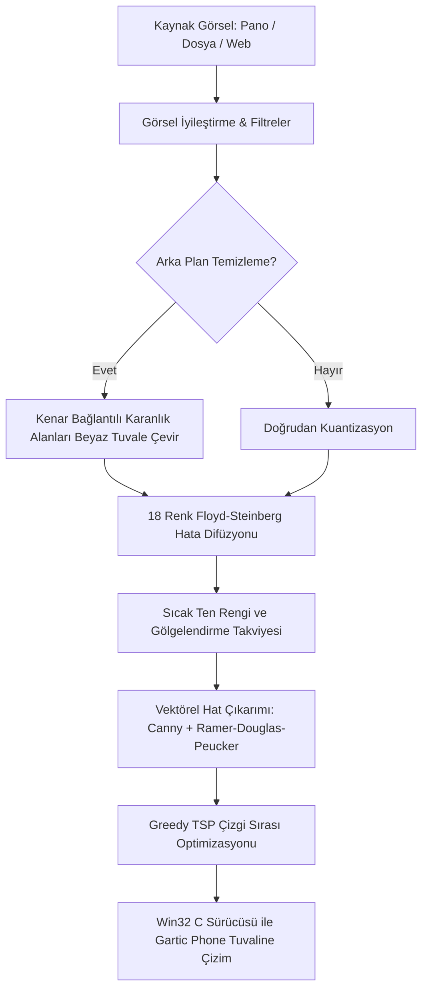

<div align="center">

# ⚡ Gartic AutoDraw AI Studio Pro

### 🎨 Ultra-Gerçekçi, 18-Renk Palet Otomasyonlu, 2K/4K Uyumlu Gartic Phone & Gartic.io Çizim Botu

[](https://www.python.org/)
[](https://microsoft.com/windows)
[](https://github.com/toprakahmetaydogmus)
[](LICENSE)
[](https://github.com/toprakahmetaydogmus)

<p align="center">
  <b>Gartic Phone</b> (<a href="https://garticphone.com/">garticphone.com</a>) ve <b>Gartic.io</b> için geliştirilmiş, insan eliyle çizilmiş gibi doğal katmanlı fırça darbeleri üreten, sıfır gecikmeli Win32 C sürücülü yeni nesil otomatik çizim stüdyosu.
</p>

</div>

---

## 🌟 Öne Çıkan Üstün Özellikler

* **🎨 Resmi 18 Renk Gartic Phone Paleti Desteği:**
  * Redmean algısal renk uzayında çalışan Floyd-Steinberg hata difüzyon algoritması.
  * Resmi 18 Gartic Phone rengini (`Ten Rengi #feafa8`, `Terracotta #cb5a57`, `Açık Mavi #26c9ff` vb.) kusursuz şekilde piksellerle eşleştirir.
* **👤 Akıllı Ten Rengi & Portre Katmanlama (Smart Skin Layering):**
  * Web kamerası veya soğuk ışık alan yüz fotoğraflarında soluk/gri zombi tonlarını engeller.
  * Ten bölgelerine otomatik sıcaklık katar, yanak ve burun kıvrımlarına doğal terracotta gölgeler yerleştirir.
* **🧹 Akıllı Kenarlık & Arka Plan Ayıklayıcı (Smart Background Cleaning):**
  * Web kamerası arka planındaki karanlık odayı veya Discord/ekran görüntüsü çerçevelerini otomatik saptar.
  * Tuvali gereksiz yere siyaha boyamak yerine saf beyaz tuval kağıdı kabul eder ve yalnızca kişiyi/nesneyi çizer.
* **✍️ Katmanlı Vektör Hat Güçlendirme (Line-Art & Inking):**
  * Önce zemin renkleri ve gölgeler serilir, ardından **en ince siyah kalemle** göz bebekleri, kirpikler, burun ve dudak kıvrımları vektörel olarak üzerine işlenir.
* **⚡ Sıfır Gecikmeli Win32 C Mouse Motoru:**
  * Standart hantal kütüphaneler yerine doğrudan Windows `user32.dll` ve `winmm.dll` C API'leri (`mouse_event`, `SetCursorPos`, `timeBeginPeriod(1)`) üzerinden 1ms hassasiyetle çizim yapar.
* **🖥️ 2K (2560x1440), 4K ve Çoklu Monitör Uyumlu:**
  * Windows High-DPI farkındalığıyla birincil 2K ekranda çizim yaparken stüdyo penceresini otomatik olarak 2. monitöre konumlandırabilir.
* **🎮 Tarayıcı İçi Tampermonkey Eklentisi:**
  * Python istemeyenler için doğrudan Chrome, Edge, Brave tarayıcısı içinde çalışan `GarticPhone_DrawBot_Tampermonkey.user.js` betiği dahildir.

---

## 🏛️ Mimari & Çalışma Prensibi



---

## ⌨️ Global Kısayol Tuşları (Hotkeys)

| Tuş | İşlev | Açıklama |
| :---: | :--- | :--- |
| **`F6`** | **2-Tık Tuval Kalibrasyonu** | Sol-üst ve sağ-alt köşeleri tıklayarak tuvali anında tanımlar. |
| **`F7`** | **Tuval Sınırlarını Test Et** | Fareniz tuval sınırlarını görsel olarak çizerek hizalamayı gösterir. |
| **`F8`** | **Otomatik Çizimi Başlat** | 3 saniyelik sesli geri sayımdan sonra çizimi başlatır. |
| **`F9`** | **Duraklat / Devam Et** | Çizimi anlık olarak durdurur veya devam ettirir. |
| **`F10` / `ESC`** | **ACİL DURDUR (Panic)** | Farenin sol tıkını anında bırakır ve tüm işlemleri iptal eder. |

---

## 🚀 Hızlı Başlangıç

### 1. Gereksinimler
* Windows 10 veya Windows 11 (64-bit)
* Python 3.10+ (veya üstü)

### 2. Kurulum
Repoyu klonlayın ve bağımlılıkları yükleyin:

```bash
git clone https://github.com/toprakahmetaydogmus/gartic-autodraw-pro.git
cd gartic-autodraw-pro
pip install -r requirements.txt
```

### 3. Çalıştırma
İster tek tıkla başlatıcıyı kullanın:
```cmd
GarticAutoDraw_Baslat.bat
```
Veya komut satırından çalıştırın:
```bash
python main.py
```

---

## 🎨 Nasıl Çizim Yapılır?

1. **Görselinizi Yükleyin:**
   * İstediğiniz herhangi bir resmi kopyalayın ve stüdyoda **`Panodan Yapıştır (Ctrl+V)`** butonuna basın.
2. **Ultra Max Kaliteye Alın:**
   * Sol paneldeki mor **`👑 ULTRA MAX PRO KALİTE`** butonuna bir kez tıklayın. Çözünürlük, ten rengi ve en ince hatlar otomatik ayarlanır.
3. **Tuvali Hizalayın:**
   * Üst menüdeki **`⚡ 2K TAM AYARLA`** butonuna tıklayın (veya özel tuval boyutunuz varsa `F6` ile sol-üst ve sağ-alt köşeleri seçin).
4. **Çizimi Başlatın:**
   * Gartic Phone ekranına geçip **`F8`** tuşuna basın. Gerisini AutoDraw Pro halletsin!

---

## 🔒 Güvenlik & Gizlilik

* **%100 Yerel (Local):** Bilgisayarınızdan internete hiçbir kişisel veri, fotoğraf veya bilgi yüklenmez.
* **API Anahtarı Gerekmez:** Harici ücretli bulut servisleri veya yapay zeka API anahtarları içermez.
* **Açık Kaynak:** Tüm kodlar incelenebilir, şeffaf ve güvenlidir.

---

## 📜 Lisans

Bu proje **MIT Lisansı** altında lisanslanmıştır. Detaylar için [LICENSE](LICENSE) dosyasına göz atabilirsiniz.

**Geliştirici:** [Toprak Ahmet Aydoğmuş](https://github.com/toprakahmetaydogmus)
