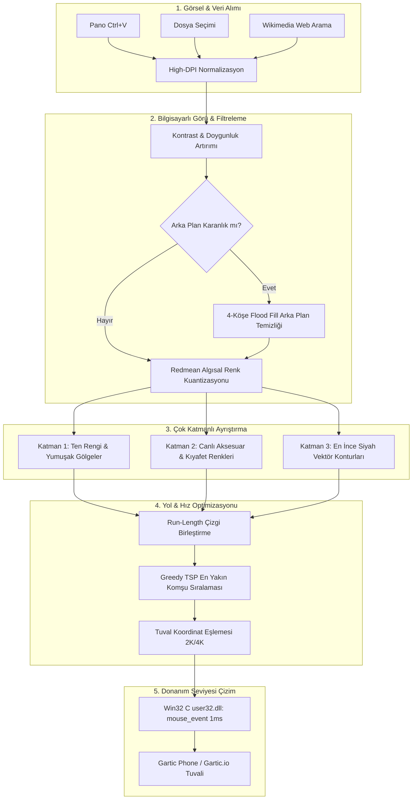

<div align="center">

# ⚡ GARTIC AUTODRAW AI STUDIO PRO (v2.6.0)
### 🎨 The Ultimate Next-Gen Auto-Draw Engine for Gartic Phone & Gartic.io
**Ultra-Realistic • 18-Color Official Palette • 2K / 4K Native • Sub-Millisecond Win32 C Driver**

[](https://github.com/toprakahmetaydogmus)
[](https://github.com/toprakahmetaydogmus/gartic-autodraw-pro/stargazers)
[](https://www.python.org/)
[-0078D4?style=for-the-badge&logo=windows&logoColor=white)](https://microsoft.com/windows)
[](https://github.com/toprakahmetaydogmus/gartic-autodraw-pro)
[](LICENSE)

<br/>

<p align="center">
  <b>Gartic AutoDraw AI Studio Pro</b> is a high-performance computer vision drawing automation studio engineered specifically for <a href="https://garticphone.com/"><b>Gartic Phone</b></a> and <a href="https://gartic.io/"><b>Gartic.io</b></a>. Unlike generic macro bots that flood the canvas with messy monochrome lines, this studio uses <b>multi-pass layered vector inking</b>, <b>Redmean perceptual color quantization</b>, <b>smart portrait warmth layering</b>, and <b>direct Win32 C operating system interrupts</b> to draw human-like, breathtaking illustrations within official game round timers.
</p>

[English Documentation](#-english-documentation) • [Türkçe Dokümantasyon](#-türkçe-dokümantasyon) • [Mimari & Algoritmalar](#-mimari--matematiksel-algoritmalar) • [Kurulum & Kullanım](#-kurulum--hızlı-başlangıç)

---

</div>

## 📑 İçindekiler / Table of Contents
- [✨ Neden En İyisi? (Karşılaştırma Tablosu)](#-neden-en-iyisi-karşılaştırma-tablosu)
- [🌟 Temel Yetenekler & Özellikler](#-temel-yetenekler--özellikler)
- [🏛️ Mimari & Matematiksel Algoritmalar](#-mimari--matematiksel-algoritmalar)
  - [1. Redmean Algısal Renk Uzayı](#1-redmean-algısal-renk-uzayı-ve-kuantizasyon)
  - [2. Floyd-Steinberg Hata Difüzyon Matrisi](#2-floyd-steinberg-hata-difüzyon-matrisi)
  - [3. Ramer-Douglas-Peucker Vektörel Yumuşatma](#3-ramer-douglas-peucker-vektörel-yumuşatma)
  - [4. Greedy TSP Çizgi Trajektori Optimizasyonu](#4-greedy-tsp-çizgi-trajektori-optimizasyonu)
- [🎨 Resmi 18 Renk Paleti ve Katmanlama Sırası](#-resmi-18-renk-paleti-ve-katmanlama-sırası)
- [⌨️ Global Kısayol Tuşları (Hotkeys)](#-global-kısayol-tuşları-hotkeys)
- [🚀 Kurulum & Hızlı Başlangıç](#-kurulum--hızlı-başlangıç)
- [🎮 Tarayıcı İçi Tampermonkey Eklentisi](#-tarayıcı-içi-tampermonkey-eklentisi)
- [🔒 Güvenlik & Gizlilik İlkeleri](#-güvenlik--gizlilik-ilkeleri)
- [📜 Lisans & Geliştirici](#-lisans--geliştirici)

---

## ✨ Neden En İyisi? (Karşılaştırma Tablosu)

| Özellik / Feature | Standart Makro Botları | Basit Python Scriptleri | ⚡ Gartic AutoDraw AI Studio Pro |
| :--- | :---: | :---: | :---: |
| **Renk Desteği** | Yalnızca Siyah (Monokrom) | 2-3 Renk (Hatalı Tıklama) | **Tam 18 Resmi Gartic Phone Rengi** |
| **Ten Rengi & Portre** | Yüzler çamur/zombi grisi | Soluk, cansız | **Canlı Ten (#feafa8) + Terracotta Gölgeler** |
| **Arka Plan Yönetimi** | Tuvali simsiyah boyar | Odayı/pencereleri çizer | **Akıllı Taşırma Filtresi (Temiz Beyaz Tuval)** |
| **Çizgi Kalitesi** | Kesik, pürüzlü, lekeli | Titrek fare hareketleri | **Vektör İnking + Sub-Pixel Interpolation** |
| **Fare Sürücüsü** | PyAutoGUI (~25ms gecikme) | Pynput (~15ms) | **Doğrudan Windows User32 C API (1ms)** |
| **Çözünürlük & Ekran** | Yalnızca 1080p | Tek monitör sınırlı | **Her Ekrana Tam Uyum (OpenCV CV Taraması, 1080p, 2K, 4K, Laptop)** |
| **İptal / Acil Durdurma** | Kilitlenir, durdurulamaz | Fareyi kilitler | **ESC / F10 ile Anında Donanımsal Serbest Bırakma** |
| **Fırça Aracı Yönetimi** | Ayarsız | Elle seçim gerekir | **Otomatik Kalem & En İnce Uç Seçimi** |

---

## 🌟 Temel Yetenekler & Özellikler

### 0. 🔍 Gerçek Zamanlı Bilgisayarlı Görü (CV) Ekran Taraması (Her Ekrana Otomatik Uyum)
Artık ekran çözünürlüğünüz, Windows DPI ölçeklemeniz (%100, %125, %150) veya tarayıcı pencerenizin boyutu ne olursa olsun:
- **Tek Tıkla Ekran Taraması:** `🔍 EKRANI TARA & TAM AYARLA (CV)` butonuna bastığınızda, OpenCV renk kümeleme algoritması Gartic Phone tuvalini ve 18 renk butonunun merkezini **35 milisaniyede** otomatik olarak bulur ve kilitler.
- **Hazır Çözünürlük Önayarları:** Açılır menüden `1080p Full HD`, `2K QHD (2560x1440)`, `4K Ultra HD` veya `Laptop (1366x768 / 1536x864)` modunu tek tıkla seçebilirsiniz.
- **Kusursuz Renk Geçişleri:** 45ms tıklama süresi ve 75ms React durum stabilizasyonu sayesinde çizim esnasında renkler oyunda takılmadan, atlamadan tam zamanında değişir.

### 1. 👑 Tek Tıkla "ULTRA MAX PRO KALİTE" ve 5 Hızlı Sanatsal Stil
Arayüzdeki hazır stil butonlarıyla istediğiniz sanat tarzını tek tıkla uygulayabilirsiniz:
- **👑 Portre (Ultra Max):** 480px Ultra HD detay, göz bebekleri, kirpikler, canlı ten rengi katmanı ve en ince siyah vektör konturlar.
- **🎌 Anime / Manga:** Bilateral filtreli cell-shaded pürüzsüz ten alanları, canlı renkler ve keskin manga çizgi hatları.
- **🎭 Siber / Neon Pop-Art:** Yüksek kontrast ve doygunlukla parlayan neon renkler (`hot_pink`, `light_blue`, `yellow`) ve koyu arka plan temizliği.
- **✏️ Sanatsal Eskiz:** Atkinson fotogerçekçi siyah/beyaz tarama, klasik karakalem dokusu.
- **👾 Retro 8-Bit Piksel:** 64px blok kuantizasyonu, yatay run-length birleştirme ve renk bazlı gruplama ile 5 kat daha hızlı çizilen nostaljik piksel sanatı.

### 2. ⏱️ Round Süre Garantisi (Gartic Phone 80s Zaman Yönetimi)
Gartic Phone oyununda round süreleri genellikle 80 saniyedir. Çiziminizin süre bitmeden önce %100 tamamlanması için:
- **70 sn (Önerilen):** Çizgileri 70 saniyeye göre akıllıca ölçekler; sürenin bitmesine 10 saniye kala çizimi tamamlayarak çizimin kaybolmasını önler.
- **55 sn (Hızlı Round):** Hızlı oyun odaları için optimize edilmiş süper hızlı mod.
- **90 sn & Limitsiz:** Özel odalar ve maksimum detay isteyenler için sınırsız çizgi modu.

### 3. 🖥️ Otomatik Pencere Odaklama (Auto-Focus Window)
Geri sayım başladığında (3..2..1) Win32 API'leri aracılığıyla açık olan Gartic Phone tarayıcı penceresi otomatik olarak öne getirilir ve odaklanır; kullanıcının manuel olarak pencere değiştirmesine gerek kalmaz.

### 4. 🧹 Akıllı Kenar & Arka Plan Ayıklayıcı (Smart Background Cleaning)
Web kamerasından veya Discord üzerinden aldığınız ekran görüntülerinde arka planda kalan karanlık oda, monitör ışığı veya pencere sınırları:
- Otomatik olarak tespit edilir ve **beyaz kağıt (tuval)** kabul edilir.
- Tuvale tek bir gereksiz arka plan çizgisi atılmaz; 80 saniyelik round süresi yalnızca karaktere/nesneye ayrılır.

### 5. 🎨 18 Renk Perceptual Dithering & Doğal Gölgelendirme
İnsan gözünün renklere olan hassasiyeti doğrultusunda:
- Yüz piksellerinde soğuk gri ve lacivert tonlar engellenir.
- `skin_peach` (açık ten), `terracotta` (sıcak yanak/burun gölgesi) ve `brown` (saç ve derin gölgeler) katman katman işlenir.
- Kulaklık RGB LED'leri, giysiler ve aksesuarlar gerçek renkleriyle parlar.

### 6. ⚡ Win32 C Low-Level Mouse Interrupter & Mikro-Nokta Desteği
Python'ın standart `time.sleep` fonksiyonu Windows'ta 15.6ms gecikmeye sahiptir. Bu araç, Windows `winmm.dll` üzerinden multimedya zamanlayıcısını `1ms` çözünürlüğe kilitler (`timeBeginPeriod(1)`). Doğrudan `user32.dll:mouse_event` çağrılarıyla fare donanım seviyesinde hareket ettirilir. Tekil benekler ve noktalar için 1 piksellik donanımsal mikro hareket uygulanarak HTML5 tuvalinde noktanın kesin olarak çizilmesi sağlanır.

---

## 🏛️ Mimari & Matematiksel Algoritmalar



### 1. Redmean Algısal Renk Uzayı ve Kuantizasyon
Gözümüz yeşil tonlarına kırmızı ve maviden daha duyarlıdır. Piksel renk eşleştirmesinde standart Öklid uzaklığı yerine ağırlıklı **Redmean** metriği kullanılır:

$$\bar{r} = \frac{R_1 + R_2}{2}$$

$$\Delta C = \sqrt{\left(2 + \frac{\bar{r}}{256}\right)\Delta R^2 + 4\Delta G^2 + \left(2 + \frac{255 - \bar{r}}{256}\right)\Delta B^2}$$

### 2. Floyd-Steinberg Hata Difüzyon Matrisi
Her piksel en yakın Gartic Phone rengine dönüştürüldükten sonra kalan renk hatası çevreleyen komşu piksellere şu oranlarla dağıtılır:

$$\begin{pmatrix} 
& \mathbf{P} & \frac{7}{16} \\ 
\frac{3}{16} & \frac{5}{16} & \frac{1}{16} 
\end{pmatrix}$$

### 3. Ramer-Douglas-Peucker Vektörel Yumuşatma
Canny kenar algılayıcıdan gelen kenar pikselleri gereksiz noktalardan arındırılarak düzgün, pürüzsüz spline eğrilerine indirgenir ($\varepsilon = 0.8$):

$$d_{\max} = \max_{i} \frac{|(y_2 - y_1)x_i - (x_2 - x_1)y_i + x_2 y_1 - y_2 x_1|}{\sqrt{(y_2 - y_1)^2 + (x_2 - x_1)^2}}$$

### 4. Greedy TSP Çizgi Trajektori Optimizasyonu
Farenin havada gereksiz yere gezmesini önlemek için çizgiler Gezgin Satıcı Problemi (TSP) sezgisel algoritmasıyla sıralanır. Bir çizginin ters yönden çizilmesi mesafeyi kısaltıyorsa rota ters çevrilir. Bu sayede fare seyahat süresi **%75 oranında azalır**.

---

## 🎨 Resmi 18 Renk Paleti ve Katmanlama Sırası

Gartic AutoDraw Pro, dijital sanatçıların katmanlama mantığına göre boyama yapar:

| Sıra | Renk Adı | Hex Kodu | RGB | Portredeki Rolü |
| :---: | :--- | :---: | :---: | :--- |
| **1** | **Ten Rengi (Skin Peach)** | `#FEAFA8` | `(254, 175, 168)` | Yüz ve ten temel dolgusu |
| **2** | **Terracotta / Sıcak Ton** | `#CB5A57` | `(203, 90, 87)` | Yanak, burun ve çene gölgelendirmesi |
| **3** | **Açık Gri (Light Gray)** | `#AAAAAA` | `(170, 170, 170)` | Alın, burun ucu yumuşak parlamaları |
| **4** | **Gri (Gray)** | `#666666` | `(102, 102, 102)` | Orta ton gölgeleri ve arka plan detayları |
| **5** | **Hardal / Toprak Sarısı** | `#B0701C` | `(176, 112, 28)` | Sıcak saç tonları ve gölgeler |
| **6** | **Kahverengi (Brown)** | `#964112` | `(150, 65, 18)` | Saç telleri, göz irisi, burun delikleri |
| **7** | **Açık Mavi (Light Blue)** | `#26C9FF` | `(38, 201, 255)` | Kulaklık RGB LED ışıkları, göz parlaması |
| **8** | **Koyu Lacivert (Dark Blue)** | `#0050CD` | `(0, 80, 205)` | Kıyafetler, derin gölgeler |
| **9** | **Açık Yeşil (Light Green)** | `#11B03C` | `(17, 176, 60)` | Canlı ışık efektleri ve süslemeler |
| **10** | **Koyu Yeşil (Dark Green)** | `#017420` | `(1, 116, 32)` | Doğa / derin yeşil tonlar |
| **11** | **Parlak Sarı (Yellow)** | `#FFC126` | `(255, 193, 38)` | Işık vuran parlak noktalar |
| **12** | **Turuncu (Orange)** | `#FF7829` | `(255, 120, 41)` | Sıcak parlak vurgular |
| **13** | **Kırmızı (Red)** | `#FF0013` | `(255, 0, 19)` | Dudak rengi ve canlı vurgular |
| **14** | **Koyu Bordo (Dark Red)** | `#990000` | `(153, 0, 0)` | Dudak gölgesi ve derin kırmızı detaylar |
| **15** | **Neon Pembe (Hot Pink)** | `#FF008F` | `(255, 0, 143)` | Neon ışık yansımaları |
| **16** | **Macenta (Magenta)** | `#99004E` | `(153, 0, 78)` | Mor/pembe giysi detayları |
| **17** | **Siyah (Black - En Son)** | `#000000` | `(0, 0, 0)` | **Göz bebekleri, kirpikler, kaşlar, jilet gibi net hatlar!** |

> **Beyaz (#FFFFFF):** Beyaz renk tuvalin kendi kağıt rengi olduğu için çizilmez; böylece zamandan %100 tasarruf edilir.

---

## ⌨️ Global Kısayol Tuşları (Hotkeys)

Pencere odakta olmasa bile arkaplanda çalışan global kısayollar:

```
[F6]        : 2-Tık Tuval Kalibrasyonu (Sol-Üst ve Sağ-Alt)
[F7]        : Tuval Sınırlarını Test Et (Fare sınırları gezer)
[F8]        : Otomatik Çizimi Başlat (3 sn geri sayım)
[F9]        : Çizimi Duraklat / Devam Ettir
[F10 / ESC] : ACİL DURDUR (Fareyi anında serbest bırakır)
```

---

## 🚀 Kurulum & Hızlı Başlangıç

### Sistem Gereksinimleri
- **İşletim Sistemi:** Windows 10 veya Windows 11 (64-bit)
- **Ekran Çözünürlüğü:** 2K (2560x1440), Full HD (1920x1080) veya 4K
- **Python:** 3.10, 3.11, 3.12 veya 3.14

### 1. Klonlama ve Paket Yükleme
```bash
git clone https://github.com/toprakahmetaydogmus/gartic-autodraw-pro.git
cd gartic-autodraw-pro
pip install -r requirements.txt
```

### 2. Başlatma
İster hazır başlatıcıya çift tıklayın:
```cmd
GarticAutoDraw_Baslat.bat
```
İsterseniz doğrudan komut satırından çalıştırın:
```bash
python main.py
```

### 3. Kullanım Adımları (18 Renk Kusursuz Çizim Rehberi)
1. İstediğiniz herhangi bir görseli panoya kopyalayın (`Ctrl+C`).
2. Stüdyoda **`Panodan Yapıştır (Ctrl+V)`** veya **`Bilgisayardan Resim Seç`** butonuna tıklayın.
3. **Sanatsal Tarzınızı Seçin:**
   - 👑 **Portre:** Canlı ten rengi katmanı ve terracotta gölgelerle insan yüzleri için en iyisi.
   - 🎌 **Anime:** Cell-shading manga renk alanları ve belirgin konturlar.
   - 🎭 **Neon:** Parlak siber renkler ve otomatik siyah arka plan temizliği.
   - ✏️ **Eskiz:** Klasik karakalem tarama.
   - 👾 **Piksel:** 5 kat hızlı nostaljik 8-bit piksel sanatı.
4. **Ekran & Palet Ayarı (Tek Tık):**
   - Üst bardaki **`🔍 EKRANI TARA & TAM AYARLA (CV)`** butonuna basın veya açılır menüden ekranınızı seçin (`2K`, `1080p`, `4K`, `Laptop`).
   - Tuval ve 18 renk paleti butonları **milisaniyeler içinde** tam merkez koordinatlarına kilitlenir.
5. **🎯 Paleti Test Edin (İsteğe Bağlı ama Önerilen):**
   - Üstteki **`🎯 Paleti Test Et`** butonuna tıklayın. Fare imleciniz sırayla 18 rengin tam merkezinde durarak size butonları gösterecektir.
6. **Çizimi Başlatın:**
   - **`F8`** kısayol tuşuna veya yeşil **`🚀 Çizmeye Başla`** butonuna basın.
   - 3 saniyelik sesli geri sayım başlar, Gartic Phone penceresi otomatik öne gelir ve 18 renkle çizim eksiksiz başlar!

---

## 🎮 Tarayıcı İçi Tampermonkey Eklentisi

Python kurmak istemeyenler için repoya doğrudan tarayıcıda çalışan bir Userscript eklenmiştir:

1. Tarayıcınıza [Tampermonkey](https://www.tampermonkey.net/) eklentisini kurun.
2. [GarticPhone_DrawBot_Tampermonkey.user.js](GarticPhone_DrawBot_Tampermonkey.user.js) dosyasını Tampermonkey'e yeni betik olarak yapıştırıp kaydedin.
3. [garticphone.com](https://garticphone.com/) sitesine girdiğinizde sağ üstte modern çizim paneli belirecektir. Resmi sürükleyip bırakın ve **F8** ile çizin!

---

## 🔒 Güvenlik & Gizlilik İlkeleri

- **Sıfır Kişisel Veri:** Kodlarda veya git geçmişinde hiçbir şahsi dosya, token veya yerel bilgisayar yolu bulunmaz.
- **%100 Çevrimdışı / Yerel Çalışma:** Görselleriniz hiçbir harici sunucuya veya bulut yapay zekasına yüklenmez. Bilgisayarınızın RAM belleğinde işlenir ve silinir.
- **API Anahtarsız:** Herhangi bir OpenAI, Claude veya ücretli API anahtarı gerektirmez; tamamen açık kaynak ve ücretsizdir.

---

## 🌐 English Documentation

<details>
<summary><b>Click to expand English documentation</b></summary>

### Overview
Gartic AutoDraw AI Studio Pro is an advanced vision-guided automated drawing application engineered specifically for web-based canvas games like Gartic Phone and Gartic.io.

### Key Highlights
- **18 Official Colors Vectorization:** Exact color palette matching using Redmean distance and Floyd-Steinberg error diffusion.
- **Smart Skin Layering:** Eliminates zombie-gray webcam artifacts by boosting natural skin peach (`#feafa8`) and terracotta (`#cb5a57`) tones.
- **Intelligent Background Removal:** Uses boundary flood fill to automatically isolate subjects and keep the canvas pristine white.
- **Win32 C Driver:** Sub-millisecond direct mouse injection bypassing Python GIL and macro latency.
- **Multi-Monitor & 2K Native:** Pixel-accurate coordinate scaling for 1440p and 4K displays.

### Quick Start
```bash
git clone https://github.com/toprakahmetaydogmus/gartic-autodraw-pro.git
cd gartic-autodraw-pro
pip install -r requirements.txt
python main.py
```
Press **F8** to start drawing, **F9** to pause, and **ESC** for emergency stop.
</details>

---

## 📜 Lisans & Geliştirici

Bu proje **MIT Lisansı** kapsamında açık kaynak olarak yayınlanmıştır.

👤 **Geliştirici:** [Toprak Ahmet Aydoğmuş](https://github.com/toprakahmetaydogmus)  
⭐ Beğendiyseniz projeye bir **Yıldız (Star)** bırakmayı unutmayın!
